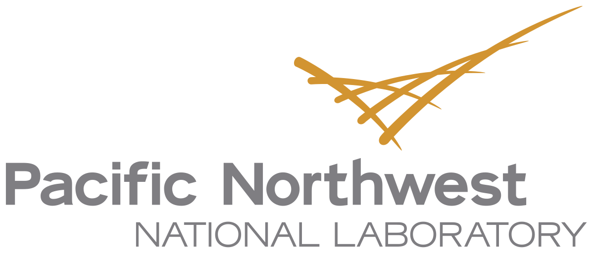
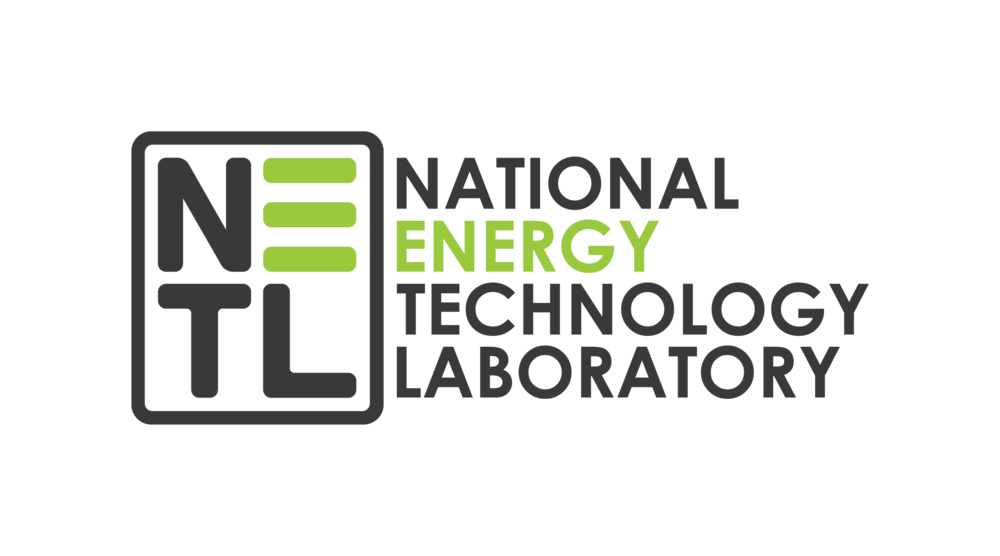
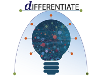

# RL-Energy
Machine learning for process system design
## Table of Contents
### Introduction
### Getting Started
### Installation
Collaborators: [PNNL](https://www.pnnl.gov/), [NETL](https://www.netl.doe.gov/), and [UW](https://www.washington.edu/) 

   
  

Funding: [ARPA-E Differentiate](https://arpa-e.energy.gov/technologies/programs/differentiate)

   
  
